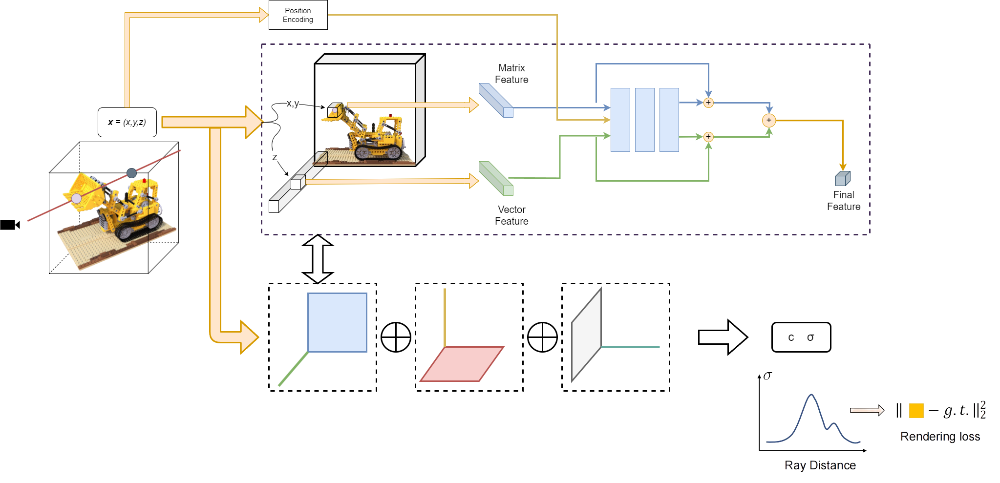

# HC-NeRF
## Hierarchical Collision Based Radiance Field Representation with Implicit Feature Fine-tuning
[arxiv]()  


## Installation

#### Tested on Ubuntu 20.04 + Pytorch 1.10.1 

Install environment:
```
conda create -n hcnerf python=3.8
conda activate hcnerf
pip install torch torchvision
pip install tqdm scikit-image opencv-python configargparse lpips imageio-ffmpeg kornia lpips tensorboard
```


## Dataset
* [Synthetic-NeRF](https://drive.google.com/drive/folders/128yBriW1IG_3NJ5Rp7APSTZsJqdJdfc1) 
* [Synthetic-NSVF](https://dl.fbaipublicfiles.com/nsvf/dataset/Synthetic_NSVF.zip)
* [Tanks&Temples](https://dl.fbaipublicfiles.com/nsvf/dataset/TanksAndTemple.zip)
* [Forward-facing](https://drive.google.com/drive/folders/128yBriW1IG_3NJ5Rp7APSTZsJqdJdfc1)


## Quick Start
The training script is in `train.py`, to train a TensoRF:

```
python train.py --config configs/lego.txt
```

if your data has already downloads, test the dataset(eq.nerf_stnthetic) with command:
```
bash train_synthetic.sh
```


we provide a few examples in the configuration folder, please note:

 `dataset_name`, choices = ['blender', 'llff', 'nsvf', 'tankstemple'];


## Rendering

```
python train.py --config configs/lego.txt --ckpt path/to/your/checkpoint --render_only 1 --render_test 1 
```

You can just simply pass `--render_only 1` and `--ckpt path/to/your/checkpoint` to render images from a pre-trained
checkpoint. You may also need to specify what you want to render, like `--render_test 1`, `--render_train 1` or `--render_path 1`.
The rendering results are located in your checkpoint folder. 

pretrained model: [google drive](https://drive.google.com/drive/folders/1kgEAVNDjS3ioN3aN-H7xgTrvfKRv6pX0?usp=drive_link)

## Training with your own data
We provide two options for training on your own image set:

1. Following the instructions in the [NSVF repo](https://github.com/facebookresearch/NSVF#prepare-your-own-dataset), then set the dataset_name to 'tankstemple'.
2. Calibrating images with the script from [NGP](https://github.com/NVlabs/instant-ngp/blob/master/docs/nerf_dataset_tips.md):
`python dataLoader/colmap2nerf.py --colmap_matcher exhaustive --run_colmap`, then adjust the datadir in `configs/your_own_data.txt`. Please check the `scene_bbox` and `near_far` if you get abnormal results.

note that our coordination system is different from original nerf's system
    

## Citation
Thanks to APChen's work [TensoRF](https://github.com/apchenstu/TensoRF)
citing:
```
@INPROCEEDINGS{Chen2022ECCV,
  author = {Anpei Chen and Zexiang Xu and Andreas Geiger and Jingyi Yu and Hao Su},
  title = {TensoRF: Tensorial Radiance Fields},
  booktitle = {European Conference on Computer Vision (ECCV)},
  year = {2022}
}
```
